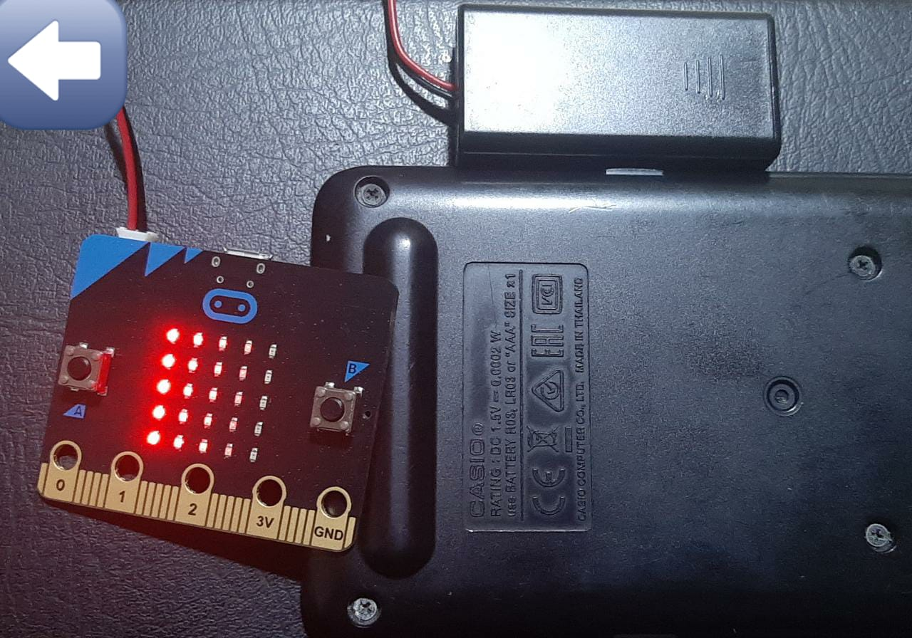
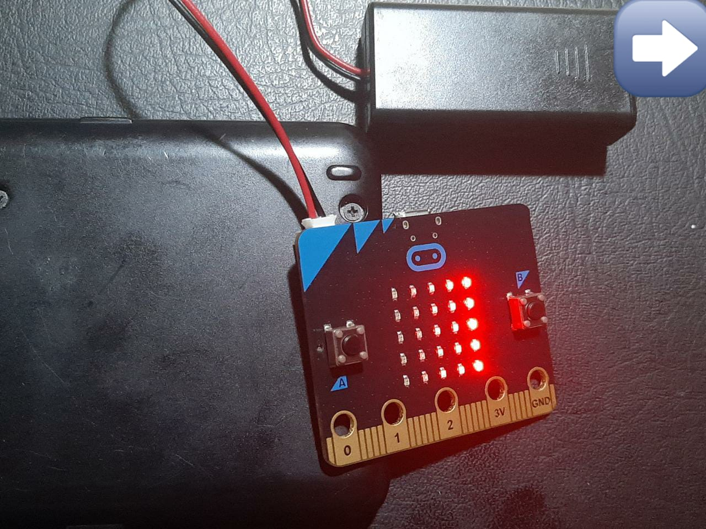
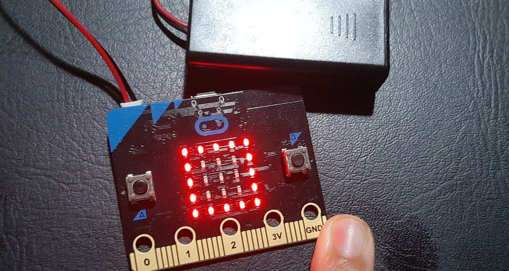

# BBC micro:bit 101 🤖

## Description

The project is created by BBC micro:bit, it detects the directions where is it! Left or right or none

> if Left : the Lighting if LED are activated from the left 9 7 5 2 0 
> if Right: the Lighting if LED are activated from the right 9 7 5 2 0 
> if non  : the square shows up

## The Code Source

1- as we are coding with python we need to import a libary which will help us to use all the functions for coding the micro:bit 

```python
from microbit import *
```
2- We need to create the show of lighting, in right and left between 0 and 9; O is off and 9 is on 

```python

R = Image("02579:"
                     "02579:"
                     "02579:"
                     "02579:"
                     "02579")


L =   Image("97520:"
                     "97520:"
                     "97520:"
                     "97520:"
                     "97520")

```

3- While true which during the program while no error; we will use the axe x it is realted to left and right 
   and rotation is between -20 20, so we will set the conditions

```python

 LR = accelerometer.get_x()
    if LR > 20:
        display.show(R)
    elif LR < -20:
        display.show(L)
    else:
        display.show(Image.SQUARE)

```

## Notes

> The project is for the absolute beginners in order to master the functions 

🟢 Demo







🟡Using


